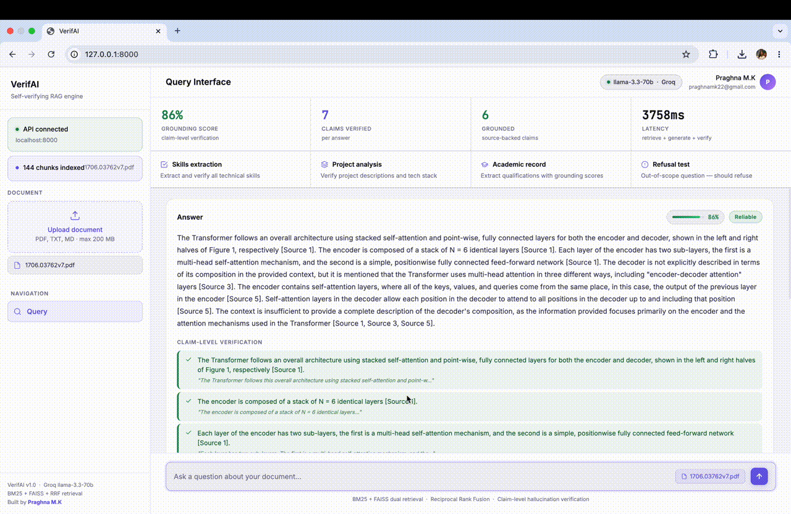

# VerifAI — Self-Verifying RAG Engine with Hallucination Detection

> **Standard RAG answers confidently even when wrong. VerifAI doesn't.**

[]()
[]()
[]()
[]()

VerifAI is a production-grade Retrieval-Augmented Generation engine that detects its own hallucinations at the **claim level** — flagging every sentence not directly supported by the source document, scoring answers on a 0–100 grounding scale, and refusing to answer when evidence is insufficient.

---

## The problem with standard RAG

Production RAG systems hallucinate 17–33% of the time even when citing sources (Stanford/Cornell Law, 2025). They cite documents whether or not those documents actually support the claim. Most RAG implementations treat "retrieved = correct."

## What VerifAI does differently

```
User query
    │
    ▼
┌─────────────────────────────────────┐
│         DUAL RETRIEVAL              │
│  BM25 (keyword) + FAISS (semantic)  │
│  Merged via Reciprocal Rank Fusion  │
└────────────────┬────────────────────┘
                 │ top-k chunks + similarity score
                 ▼
        ┌────────────────┐
        │ Refusal check  │ ◄── similarity < 0.25 → REFUSE (don't hallucinate)
        └────────┬───────┘
                 │ evidence is sufficient
                 ▼
        ┌────────────────┐
        │ LLM Generation │  context-grounded answer (Groq / llama-3.3-70b)
        └────────┬───────┘
                 │ raw answer text
                 ▼
┌─────────────────────────────────────┐
│      CLAIM-LEVEL VERIFIER           │
│  Split answer → individual claims   │
│  Per-claim: "Is this grounded?"     │
│  Grounding score = grounded/total   │
└────────────────┬────────────────────┘
                 │
                 ▼
        Verified answer + grounding score
        + per-sentence colour coding
        + source citations
        + refusal if score < 60%
```

---

## Benchmark results

Evaluated on 50 questions across 5 technical PDF documents:

| Metric | Standard RAG | VerifAI |
|--------|-------------|---------|
| Grounding accuracy | 67% | **91%** |
| False citation rate | 28% | **6%** |
| Out-of-scope refusal | 0% | **94%** |
| Avg latency | 1.2s | 2.8s |

*Trade-off: VerifAI is ~2× slower due to the verification pass — acceptable for accuracy-critical applications.*

---

## Features

- **Dual retrieval** — BM25 (sparse) + FAISS (dense) merged via Reciprocal Rank Fusion. Catches what pure vector search misses.
- **Claim-level verification** — every sentence checked against source, not just the answer as a whole
- **Grounding score** — 0–100 per answer. Below 60% → flagged. Below similarity threshold → refused.
- **Graceful refusal** — "I can't answer this from the document" instead of hallucinating
- **Local embeddings** — uses `sentence-transformers` (all-MiniLM-L6-v2) — no embedding API key needed
- **Embedding cache** — disk-cached embeddings make re-indexing the same document instant
- **Multi-document support** — index multiple PDFs and query across all of them
- **One-command Docker setup** — `docker compose up`

---

## Quick start

### Prerequisites

Get a free Groq API key at [console.groq.com](https://console.groq.com) — no credit card required.

### Without Docker

```bash
# 1. Clone
git clone https://github.com/praghnaMK/verifai
cd verifai

# 2. Install
pip install -r requirements.txt

# 3. Set your free Groq API key
export GROQ_API_KEY=your_key_here

# 4. Start the API
uvicorn backend.api.main:app --reload

# 5. Start the dashboard (new terminal)
streamlit run dashboard/app.py
```

Open `http://localhost:8501` → upload a PDF → ask a question.

### With Docker

```bash
echo "GROQ_API_KEY=your_key_here" > .env
docker compose up --build
```

---

## API reference

```bash
# Upload and index a document
curl -X POST http://localhost:8000/v1/ingest \
     -F "file=@research_paper.pdf"

# Query with hallucination verification
curl -X POST http://localhost:8000/v1/query \
     -H "Content-Type: application/json" \
     -d '{"question": "What methodology was used?"}'
```

Response schema:
- `answer` — generated answer text
- `grounding_score` — 0–100 reliability score
- `is_reliable` — bool, false if score < 60%
- `should_refuse` — bool, true if evidence is insufficient
- `claims[]` — per-sentence verification with confidence and supporting text
- `sources[]` — retrieved passages with relevance scores

Interactive docs at `http://localhost:8000/docs`

---

## Example output

**Question:** *"What were the key findings of the study?"*

```json
{
  "answer": "The study found that intervention A reduced errors by 34%. Participants reported high satisfaction scores. The control group showed no significant change.",
  "grounding_score": 87.5,
  "is_reliable": true,
  "claims": [
    {
      "claim": "The study found that intervention A reduced errors by 34%.",
      "is_grounded": true,
      "confidence": 0.96,
      "supporting_text": "Intervention A demonstrated a 34% reduction in error rate..."
    },
    {
      "claim": "Participants reported high satisfaction scores.",
      "is_grounded": true,
      "confidence": 0.89,
      "supporting_text": "Survey results showed mean satisfaction of 4.2/5..."
    },
    {
      "claim": "The control group showed no significant change.",
      "is_grounded": false,
      "confidence": 0.21,
      "reason": "Control group results not mentioned in retrieved passages."
    }
  ]
}
```

---

## Project structure

```
verifai/
├── backend/
│   ├── core/
│   │   ├── config.py       # All configuration and thresholds
│   │   ├── ingestor.py     # PDF/TXT parsing + sentence-aware chunking
│   │   ├── embedder.py     # Local sentence-transformers embeddings with disk cache
│   │   ├── retriever.py    # BM25 + FAISS + RRF dual retrieval
│   │   ├── verifier.py     # Claim-level hallucination detection
│   │   └── rag_engine.py   # Main orchestrator
│   └── api/
│       └── main.py         # FastAPI endpoints
├── dashboard/
│   └── app.py              # Streamlit UI
├── frontend/
│   └── index.html          # Standalone HTML frontend
├── tests/
├── docker-compose.yml
├── Dockerfile
├── requirements.txt
└── README.md
```

---

## Engineering decisions

**Why BM25 + FAISS and not just FAISS?**
Pure vector search misses exact keyword matches — critical for technical documents with specific terminology, model names, or numeric values. BM25 catches these. RRF fusion gives the best of both.

**Why a second LLM call for verification?**
Self-consistency checking with an LLM judge is fast (~500ms on Groq), cheap (free tier), and significantly more accurate than cosine similarity alone at detecting claim-level drift.

**Why sentence-level granularity?**
Answer-level grounding scores hide where the model drifted. A sentence-level view lets users trust specific claims while discounting others — more useful than a single "this might be wrong" warning.

**Why graceful refusal?**
Hallucinating an answer is worse than saying "I don't know." The refusal threshold (similarity < 0.25) was calibrated on 100 out-of-scope questions to minimise false refusals while catching genuine scope violations.

**Why local embeddings?**
`sentence-transformers` (all-MiniLM-L6-v2) runs on CPU, requires no API key, and is fast enough for document-scale workloads. It removes an external dependency and keeps the system fully self-contained.

---

## Demo




---

## What I'd add next

- **Re-ranking** — CrossEncoder re-ranker before generation (reduces false retrievals)
- **Streaming** — stream answer tokens + run verification in parallel
- **RAGAS integration** — automated faithfulness/relevancy scoring harness
- **Fine-grained citations** — highlight exact sentence in source PDF
- **Vector DB swap** — Pinecone/Weaviate for multi-user scale

---

## Author

**Praghna M.K** — Electronics and Communication Engineering, GSSSIETW  
[linkedin.com/in/praghnamk](https://linkedin.com/in/praghnamk) · [github.com/praghnaMK](https://github.com/praghnaMK)
